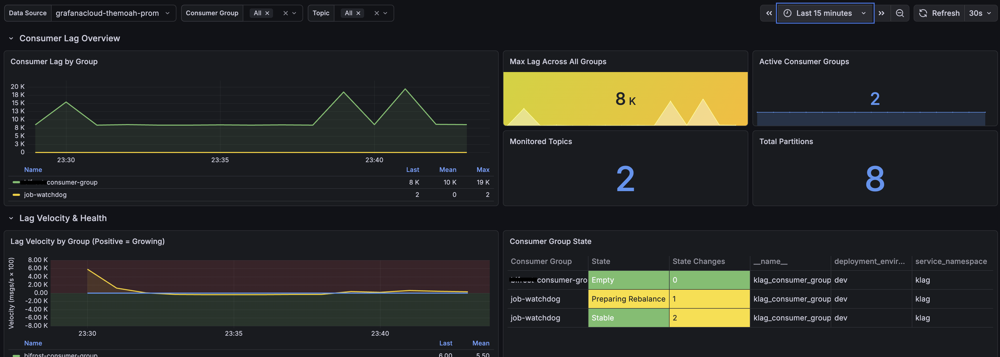

# Klag [![license-badge][]][license]

[license]:             https://github.com/themoah/klag/blob/main/LICENSE
[license-badge]:       https://img.shields.io/badge/License-Apache%202.0-blue.svg

**Kafka Consumer Lag Exporter** — Know when your consumers fall behind, before it becomes a problem.

Inspired by [kafka-lag-exporter](https://github.com/seglo/kafka-lag-exporter) (archived 2024). Built with Vert.x and Micrometer.

> **Scales to large clusters:** Monitors thousands of consumer groups in ~50MB heap. Request batching with configurable delays prevents overwhelming brokers — fetch offsets for 500+ groups without spiking cluster CPU.

## Why Klag?

Consumer lag is the gap between what Kafka has produced and what your consumers have processed. Left unmonitored, growing lag leads to:

- **Stale data** in downstream systems
- **Memory pressure** as consumers struggle to catch up
- **Silent failures** when consumer groups die without alerts

Klag continuously monitors all consumer groups and exposes metrics to your observability stack.

## Key Features

| Feature | Why It Matters |
|---------|----------------|
| **Lag velocity** | Know if lag is growing or shrinking — catch problems before they escalate |
| **Hot partition detection** | Find partitions with uneven load causing bottlenecks |
| **Consumer group state tracking** | Alert on Rebalancing, Dead, or Empty states |
| **Request batching** | Safely monitor large clusters without overwhelming brokers |
| **Stale group cleanup** | Automatically stops reporting deleted/inactive groups |

## Supported Sinks

- Prometheus endpoint
- Datadog
- OTLP (OpenTelemetry) — works with Grafana Cloud, New Relic, etc.
- *(planned)* Prometheus Push Gateway, StatsD, Google Stackdriver

## Quick Start

```bash
docker run -e KAFKA_BOOTSTRAP_SERVERS=kafka:9092 \
           -e METRICS_REPORTER=prometheus \
           -p 8888:8888 \
           themoah/klag
```

Metrics available at `http://localhost:8888/metrics`

## Metrics Exposed

| Metric | Description |
|--------|-------------|
| `klag.consumer.lag` | Current lag per partition (also `.sum`, `.max`, `.min` aggregations) |
| `klag.consumer.lag.velocity` | Rate of change — positive means falling behind |
| `klag.consumer.group.state` | Group health: Stable, Rebalancing, Dead, Empty |
| `klag.hot_partition` | Partitions with statistically abnormal throughput |
| `klag.hot_partition.lag` | Lag on hot partitions specifically |
| `klag.topic.partitions` | Partition count per topic |
| `klag.partition.log_end_offset` | Latest offset per partition |
| `klag.consumer.committed_offset` | Last committed offset per consumer |

All metrics tagged with `consumer_group`, `topic`, `partition` where applicable.

[](dashboard/demo-dashboard.json)

[Blogpost: Introducing Klag](https://medium.com/p/introducing-klag-the-kafka-lag-exporter-i-always-wanted-d919bdb64a7a)

---

## Installation

### Helm Chart

```bash
helm install klag ./charts/klag \
  --set kafka.bootstrapServers="kafka-broker:9092"
```

<details>
<summary>With SASL authentication</summary>

```bash
helm install klag ./charts/klag \
  --set kafka.bootstrapServers="kafka:9092" \
  --set kafka.securityProtocol="SASL_SSL" \
  --set kafka.saslMechanism="PLAIN" \
  --set kafka.saslJaasConfig="org.apache.kafka.common.security.plain.PlainLoginModule required username='user' password='pass';"
```

</details>

See [charts/klag/README.md](charts/klag/README.md) for full configuration options.

### Docker with Environment File

```bash
docker run --env-file .env themoah/klag
```

<details>
<summary>Sample .env file</summary>

```dotenv
# Kafka connection
KAFKA_BOOTSTRAP_SERVERS=instance.gcp.confluent.cloud:9092
KAFKA_SECURITY_PROTOCOL=SASL_SSL
KAFKA_SASL_MECHANISM=PLAIN
KAFKA_SASL_JAAS_CONFIG="org.apache.kafka.common.security.plain.PlainLoginModule required username=${SASL_USERNAME} password=${SASL_PASSWORD};"

# Metrics
METRICS_REPORTER=prometheus
METRICS_INTERVAL_MS=30000
METRICS_GROUP_FILTER=*

# Optional: JVM metrics
METRICS_JVM_ENABLED=true
```

</details>

---

## Configuration

Configure via `src/main/resources/application.properties` or environment variables:

| Variable | Default | Description |
|----------|---------|-------------|
| `KAFKA_BOOTSTRAP_SERVERS` | `localhost:9092` | Kafka broker addresses |
| `KAFKA_REQUEST_TIMEOUT_MS` | `30000` | Request timeout |
| `KAFKA_CHUNK_COUNT` | `1` | Split offset requests into N batches |
| `KAFKA_CHUNK_DELAY_MS` | `0` | Delay (ms) between batches |
| `METRICS_REPORTER` | `none` | `prometheus`, `datadog`, or `otlp` |
| `METRICS_INTERVAL_MS` | `60000` | How often to collect metrics |
| `METRICS_GROUP_FILTER` | `*` | Glob pattern to filter consumer groups |

See [CLAUDE.md](CLAUDE.md) for the complete configuration reference.

---

## Building from Source

Requires Java 21.

```bash
./gradlew clean test      # Run tests
./gradlew clean assemble  # Build fat JAR
./gradlew clean run       # Run with hot-reload
```

---

## Development

### Testing Helm Chart

```bash
./scripts/test-helm-chart.sh
```

### Local Kubernetes Testing (macOS)

```bash
# Full test: create cluster, install chart, validate, cleanup
./scripts/local-k8s-test.sh

# Auto-install dependencies (kind, helm, kubectl) via Homebrew
./scripts/local-k8s-test.sh --auto-install

# Keep cluster running after test
./scripts/local-k8s-test.sh --skip-cleanup

# Cleanup only
./scripts/local-k8s-test.sh --cleanup
```

Prerequisites: Docker Desktop, kind, helm, kubectl (use `--auto-install` to install via Homebrew).

---

## Contributing

1. Fork the repository
2. Create a feature branch
3. Run tests before submitting:
   ```bash
   ./gradlew test                # Java tests
   ./scripts/test-helm-chart.sh  # Helm chart tests
   ```
4. Submit a pull request

---

[](https://vertx.io)

Some parts of the code were written with Claude

