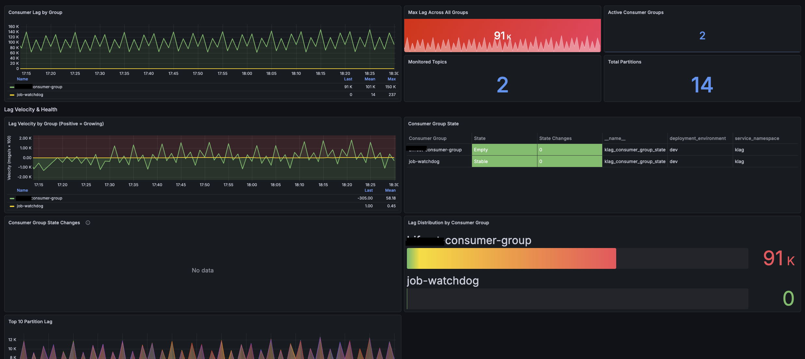

# Klag [![license-badge][]][license]

[license]:             https://github.com/themoah/klag/blob/main/LICENSE
[license-badge]:       https://img.shields.io/badge/License-Apache%202.0-blue.svg

**Kafka Consumer Lag Exporter** — Know when your consumers fall behind, before it becomes a problem.

Inspired by [kafka-lag-exporter](https://github.com/seglo/kafka-lag-exporter) (archived 2024). Built with Vert.x and Micrometer.

Migrating from kafka-lag-exporter? See the **[migration guide](https://klag.dev/migration)** (metric/label/config mapping + drop-in dashboard tips).

> ### 📖 Documentation lives at **[klag.dev](https://klag.dev)**
>
> Full guides — configuration, Kafka ACLs, Helm/Strimzi deployment, integrations,
> metrics reference, and development — are at **[klag.dev](https://klag.dev)**.
> AI agents: a machine-readable corpus is at [klag.dev/llms.txt](https://klag.dev/llms.txt).
> The docs source lives in [`website/`](website/) (Astro + Starlight).

> **Scales to large clusters:** Monitors thousands of consumer groups in ~50MB heap. Request batching with configurable delays prevents overwhelming brokers — fetch offsets for 500+ groups without spiking cluster CPU.

## Why Klag?

Consumer lag is the gap between what Kafka has produced and what your consumers have processed. Left unmonitored, growing lag leads to stale downstream data, memory pressure as consumers struggle to catch up, and silent failures when groups die without alerts. Klag continuously monitors all consumer groups and exposes metrics to your observability stack.

## Key Features

| Feature                           | Why It Matters                                                            |
|-----------------------------------|---------------------------------------------------------------------------|
| **Lag velocity**                  | Know if lag is growing or shrinking — catch problems before they escalate |
| **Time-based lag estimation**     | See lag in seconds/minutes, not just message counts                       |
| **Hot partition detection**       | Find partitions with uneven load causing bottlenecks                      |
| **Consumer group state tracking** | Alert on Rebalancing, Dead, or Empty states                               |
| **Data loss prevention**          | Alert before lag exceeds retention and data is lost                       |
| **Request batching**              | Safely monitor large clusters without overwhelming brokers                |
| **AI-native**                     | Opt-in read-only [MCP endpoint](https://klag.dev/ai/mcp/) for SRE/dev agents |

**Sinks:** Prometheus, Datadog, OTLP (Grafana Cloud, New Relic, etc.). See [integrations](https://klag.dev/integrations/prometheus/).

## How Klag compares

Klag, [Burrow](https://github.com/linkedin/Burrow), and [KMinion](https://github.com/redpanda-data/kminion) all monitor Kafka consumer lag. They differ in what they measure and where they send it.

| Feature | Klag | Burrow | KMinion |
|---|:---:|:---:|:---:|
| Lag in messages | ✅ | ✅ | ✅ |
| Consumer group state | ✅ | ✅ | ✅ |
| Lag velocity (growing/shrinking) | ✅ | ⚠️ status only | ❌ |
| Time-based lag + time-to-catch-up | ✅ | ❌ | ❌ |
| Hot partition detection | ✅ | ❌ | ❌ |
| Data loss / retention alerting | ✅ | ❌ | ❌ |
| Lag status rules + notifiers | ❌ | ✅ | ❌ |
| Prometheus / Datadog / OTLP native | ✅ | ⚠️ exporter / ❌ / ❌ | ✅ / ❌ / ❌ |
| AI agent endpoint (MCP) | ✅ | ❌ | ❌ |
| Read-only ACLs (DESCRIBE only) | ✅ | ✅ | ⚠️ writes for e2e |

## Quick Start

```bash
docker run -e KAFKA_BOOTSTRAP_SERVERS=kafka:9092 \
           -e METRICS_REPORTER=prometheus \
           -p 8888:8888 \
           themoah/klag:latest
```

Metrics available at `http://localhost:8888/metrics`.

A GraalVM native image (`themoah/klag:native`) starts in ~70-100 ms using ~44 MB RSS,
versus ~500 ms / ~119 MB for the JVM image — same config, endpoints, and metrics. See
[Native Image](https://klag.dev/deployment/native-image/).

### Helm

```bash
helm repo add klag https://themoah.github.io/klag
helm repo update
helm install klag klag/klag --set kafka.bootstrapServers="kafka-broker:9092"
```

Published to [Artifact Hub](https://artifacthub.io/packages/helm/klag/klag). Full chart
config, SASL, and Strimzi: [Kubernetes deployment](https://klag.dev/deployment/kubernetes/)
and [charts/klag/README.md](charts/klag/README.md).

## Metrics

| Metric | Description                                                          |
|--------|----------------------------------------------------------------------|
| `klag.consumer.lag` | Current lag per partition (also `.sum`, `.max`, `.min`)             |
| `klag.consumer.lag.velocity` | Rate of change — positive means falling behind            |
| `klag.consumer.lag.ms` | Lag in ms from Kafka log timestamps                            |
| `klag.consumer.lag.time_to_close_seconds` | Estimated seconds until lag reaches zero    |
| `klag.consumer.lag.retention_percent` | Lag as % of available messages (data loss alerting) |
| `klag.consumer.group.state` | Group health: Stable, Rebalancing, Dead, Empty           |
| `klag.hot_partition[.lag]` | Partitions with statistically abnormal throughput         |

Full metrics reference and the pre-built [Grafana dashboard](https://klag.dev/integrations/grafana-dashboard/)
are documented at [klag.dev/metrics](https://klag.dev/metrics/overview/). The dashboard is on
[Grafana.com (ID 25379)](https://grafana.com/grafana/dashboards/25379-klag-kafka-lag-monitoring/) —
import by ID or use `dashboard/demo-dashboard.json`.

[](dashboard/demo-dashboard.json)

[Blogpost: Introducing Klag](https://medium.com/p/introducing-klag-the-kafka-lag-exporter-i-always-wanted-d919bdb64a7a)

## Configuration

Configure via `src/main/resources/application.properties` or environment variables. The
most common:

| Variable | Default | Description |
|----------|---------|-------------|
| `KAFKA_BOOTSTRAP_SERVERS` | `localhost:9092` | Kafka broker addresses |
| `HTTP_PORT` | `8888` | HTTP server port (health, metrics, MCP) |
| `METRICS_REPORTER` | `none` | `prometheus`, `datadog`, or `otlp` |
| `METRICS_INTERVAL_MS` | `60000` | How often to collect metrics |
| `METRICS_GROUP_FILTER` | `*` | Comma-separated glob patterns. A group is included if it matches any segment (e.g. `ingest*,categorize*`). |
| `METRICS_GROUP_EXCLUDE` | _(empty)_ | Comma-separated glob patterns to exclude even if included by the filter (e.g. `debug-*,canary-*,*-shadow`). |

Any variable can also be set as a JVM system property — `-DNAME` or its dotted-lowercase
form `-Dname.dotted` (e.g. `HTTP_PORT` → `-Dhttp.port=8881`) — useful when running the jar
or native binary directly. Env vars take precedence. This works on the GraalVM native
binary too (runtime `-D` flags).

See [CLAUDE.md](CLAUDE.md) for the complete configuration reference.

---

## Broker Compatibility

Klag works with Apache Kafka **2.x and 3.x** brokers.

### Running against Kafka 2.x

When klag first talks to a 2.x broker, you'll see a single WARN log line — emitted **once per process**, not per topic and not per scrape:

```
MAX_TIMESTAMP listOffsets unsupported by broker (likely pre-Kafka 3.0);
falling back to LATEST for logEndTimestamp. Logged once per process;
further occurrences at DEBUG. Cause: ...
```

**This is expected, and safe to ignore.** All klag metrics remain accurate. Subsequent per-topic fallback events are emitted at DEBUG; flip `LOG_LEVEL_KLAG=DEBUG` if you want to see them.

<details>
<summary>Why this happens, and why the fallback exists at all</summary>

Klag asks the broker for partition end-offsets using `OffsetSpec.MAX_TIMESTAMP`, an API added in Kafka 3.0 ([KIP-734](https://cwiki.apache.org/confluence/display/KAFKA/KIP-734%3A+Improve+AdminClient.listOffsets+to+return+timestamp+and+offset+for+the+record+with+the+largest+timestamp)). 2.x brokers don't support it and respond with `UnsupportedVersionException`. Klag catches that and falls back to `OffsetSpec.LATEST`, which every Kafka version supports. The fallback returns the same partition end-offset that drives every lag metric, so accuracy is preserved.

**Why the fallback is necessary.** Without it, klag refuses to start on a 2.x cluster. The first metrics scrape runs synchronously during klag's startup, and a failure there propagates back up to the process launcher, which exits with code 1 — CrashLoopBackOff under Kubernetes. One consumer group on a 2.x cluster was enough to brick startup.

**Note for future contributors.** On 2.x brokers, both `logEndTimestamp` and `maxTimestampOffset` fall back to the LATEST offset's timestamp/offset, so time-based lag interpolation degrades gracefully (the anchor becomes the broker-side append time of the last record rather than the highest-timestamp record).

</details>

---

## Kafka ACL Permissions

Klag requires **read-only** access to monitor consumer lag. It uses only the Kafka Admin Client API with DESCRIBE permissions—no write or alter access needed.

### Required Permissions

| Resource | Name | Permission | Operations |
|----------|------|------------|------------|
| CLUSTER | kafka-cluster | DESCRIBE | Health check, list consumer groups |
| TOPIC | `*` or prefixed | DESCRIBE | Get partition info and offsets |
| GROUP | `*` or prefixed | DESCRIBE | Get group state and committed offsets |

### Self-Managed Kafka

<details>
<summary>Monitor all groups and topics</summary>

```bash
# Cluster permissions (required)
kafka-acls --bootstrap-server <broker> \
  --add --allow-principal User:<klag-user> \
  --operation Describe --cluster

# All topics
kafka-acls --bootstrap-server <broker> \
  --add --allow-principal User:<klag-user> \
  --operation Describe --topic '*'

# All consumer groups
kafka-acls --bootstrap-server <broker> \
  --add --allow-principal User:<klag-user> \
  --operation Describe --group '*'
```

</details>

Klag needs **read-only** Kafka access (Admin Client DESCRIBE on cluster, topics, groups).
Full configuration reference and ACL setup (self-managed + Confluent Cloud) are at
[klag.dev/configuration](https://klag.dev/configuration/reference/) and
[klag.dev/kafka/acl-permissions](https://klag.dev/kafka/acl-permissions/).

## Development

Requires Java 21.

```bash
./gradlew clean test      # Run tests
./gradlew clean assemble  # Build fat JAR
./gradlew clean run       # Run with hot-reload
```

End-to-end tests (k3d + real Kafka, Strimzi matrix) live in `scripts/`. See
[Build from Source](https://klag.dev/development/build/) and
[Contributing](https://klag.dev/development/contributing/).

---

[](https://vertx.io)

Some parts of the code were written with Claude

</content>
</invoke>
