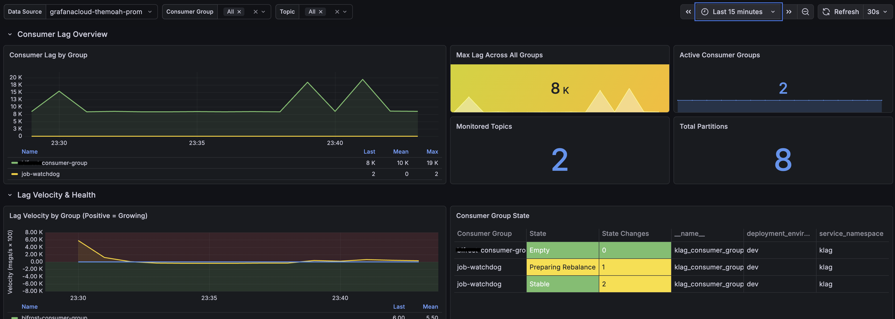

Klag ships a comprehensive, pre-built Grafana dashboard. It's published on
[Grafana.com](https://grafana.com/grafana/dashboards/25379-klag-kafka-lag-monitoring/)
(dashboard ID **25379**) and lives in the repo at
[`dashboard/demo-dashboard.json`](https://github.com/themoah/klag/blob/main/dashboard/demo-dashboard.json).

## Import

Pick either path:

**By dashboard ID (recommended)**

1. In Grafana, go to **Dashboards → New → Import**.
2. Enter ID **25379**, click **Load**.
3. Select your OTLP/Prometheus-compatible data source, click **Import**.

**From the repo**

1. In Grafana, go to **Dashboards → New → Import**.
2. Upload `dashboard/demo-dashboard.json`.
3. Select your OTLP/Prometheus-compatible data source.
4. Adjust the refresh interval and time range as needed.

## What's included

- **Consumer Lag Overview**: real-time lag by group with color-coded thresholds.
- **Lag Velocity Tracking**: is lag growing or shrinking over time.
- **Consumer Group Health**: state table with alerts for unhealthy states.
- **Partition & Offset Details**: topic throughput and per-partition lag.
- **Hot Partition Detection**: count, table, and time series.
- **Time-Based Lag**: max time lag, groups catching up, time-to-close charts.
- **Data Loss Prevention**: retention-risk and at-risk topics panels.
- **JVM panels**: memory, GC pause, threads, CPU, allocation rate, loaded classes.
- **Template variables**: filter by consumer group and topic; auto-refresh every minute.

## Requirements

- Klag running with `METRICS_REPORTER=otlp` (or `prometheus`).
- Metrics flowing to Grafana Cloud or a Prometheus-compatible backend.
- A data source configured in Grafana with PromQL support.
